# Computer_Animation_HW-VS2015
All of the projects are developed in VS2015, it includes many topics on computer animation, such as Curve, Kinematics or Inverse Kinematics, etc.

# Description
* **Curve Editor**
  an interactive 2D curve editor
* **Rotation**
  * Implement the conversions between the three different (but equivalent) orientation representations:
    * Euler Angles
    * Rotation matrix
    * Quaternions
  * Interpolation of quaternions using linear and cubic splines
* **Forward Kinematics**
  Implement forward kinematics using homogeneous transformations. The features I implement will lay the groundwork for animating characters using motion capture data and keyframe splines in the subsequent assignments. After completing this assignment, you will be able to load a BVH motion capture file and play back the animation on a character.
* **Inverse Kinematics**
  Implement the analytic (i.e. limb-based) and CCD (i.e. cyclic coordinate descent) forms of inverse kinematics, as well as Persudo Inverse form IK, in order to control the position of the hands and feet of the Beta character.
* **Particle Systems**
  Implement a basic particle system simulation and a basic fireworks simulation.
* **Behavioral Animation**
  The implementation of behaviors for characters used in games and crowd simulations. (2D disk-shaped vehicle)
  
  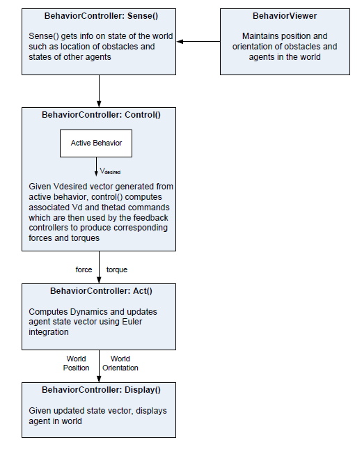
# Results & Demos
* **Curve Editor**
  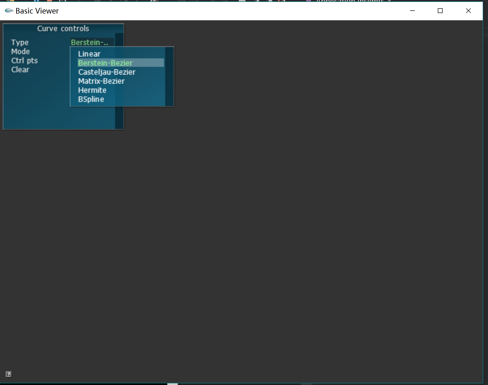
  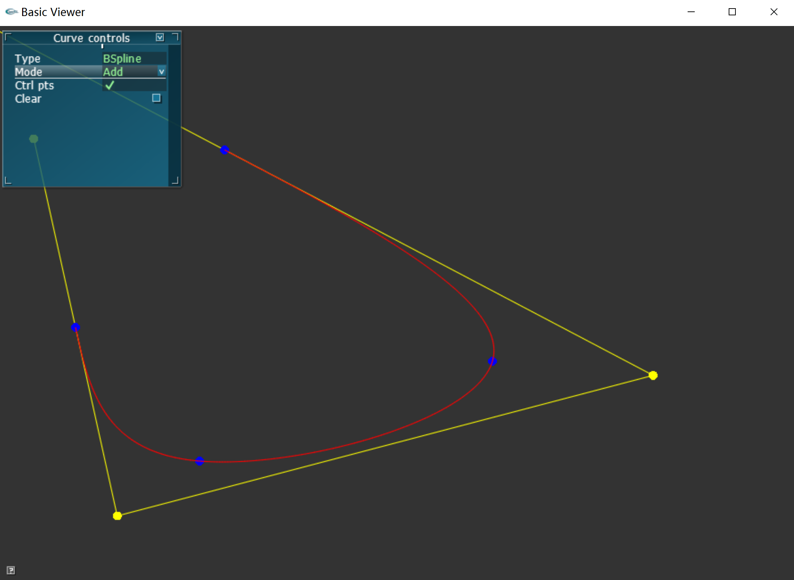

* **Rotation**
  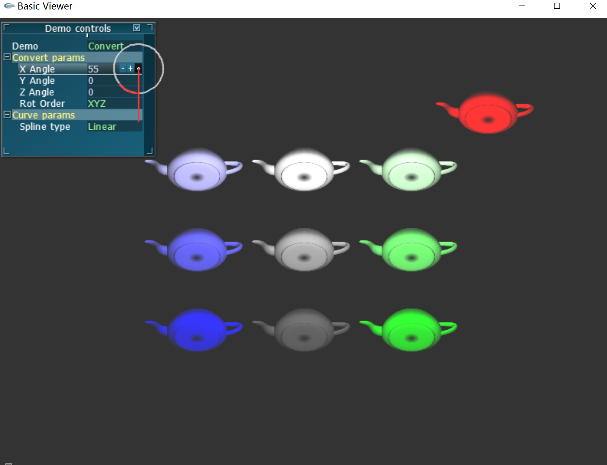
  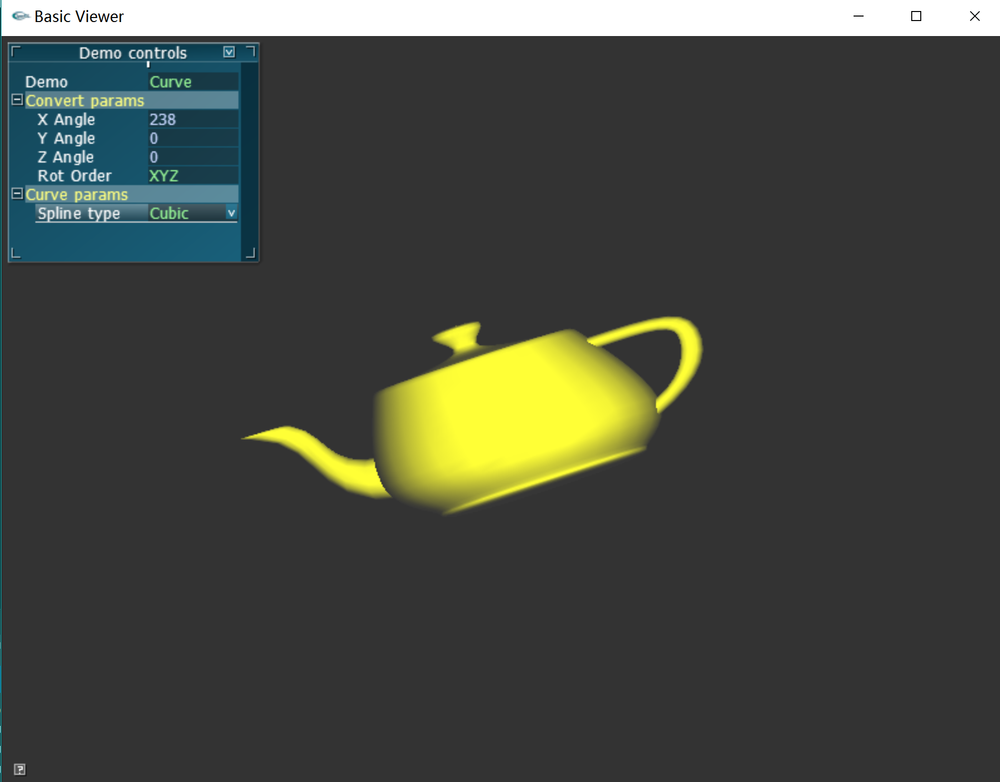

* **Forward Kinematics**
  [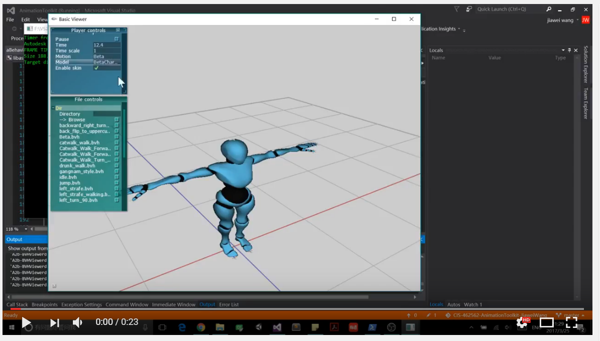](https://youtu.be/95jWiHhXON4)
  
* **Inverse Kinematics**
  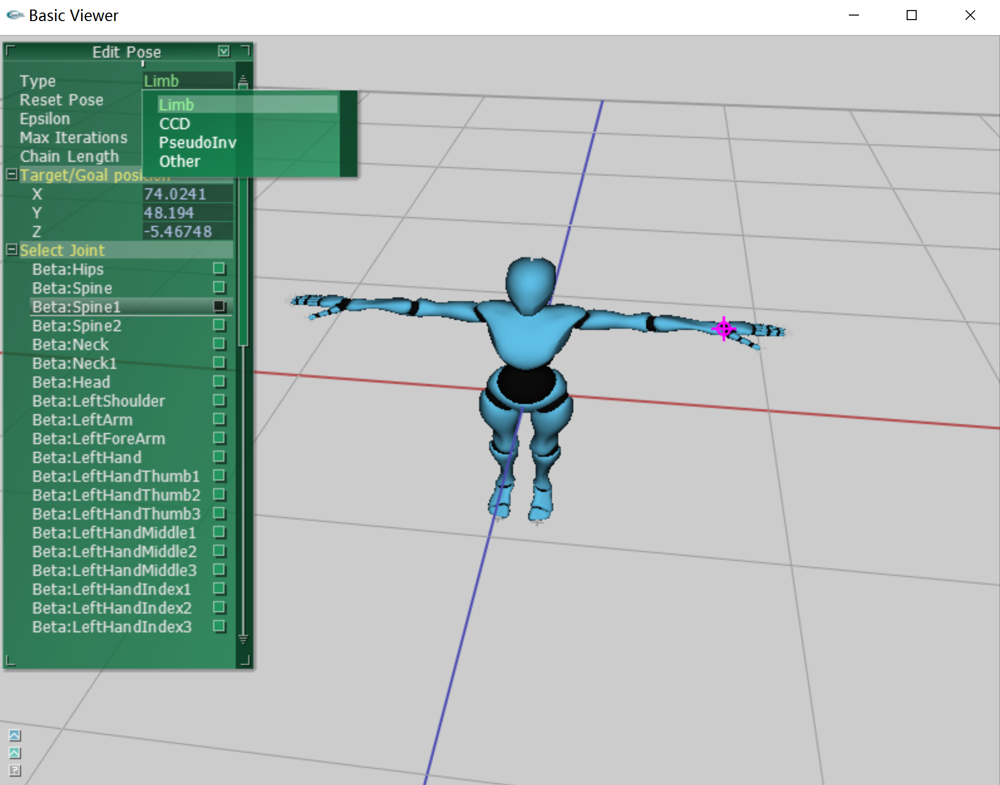
  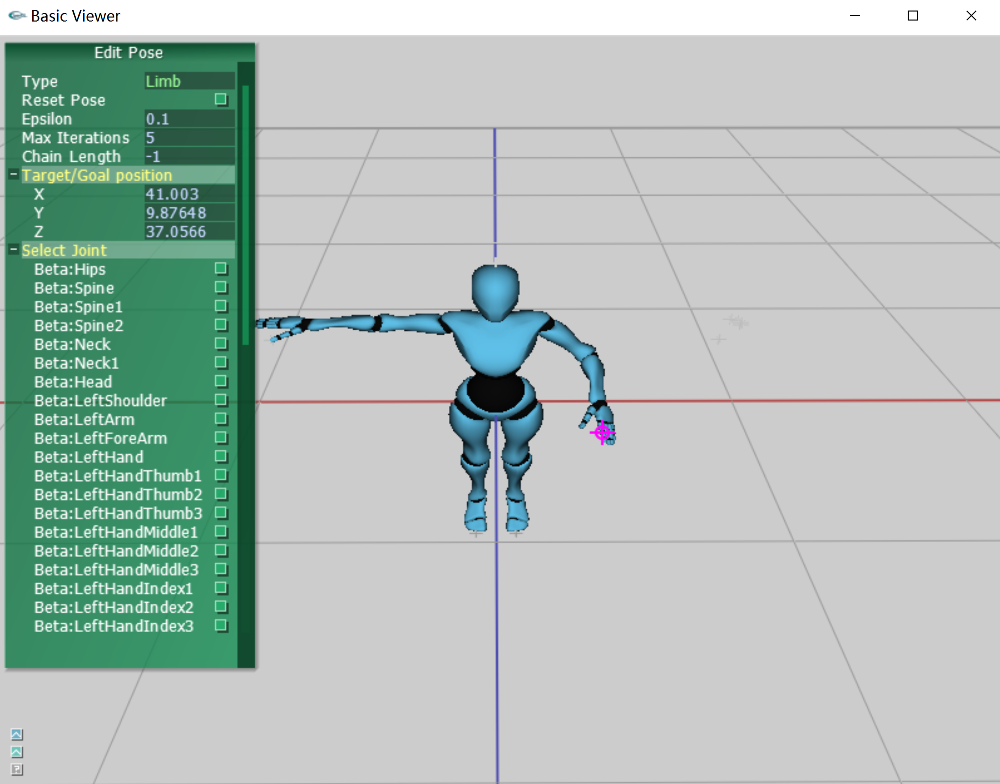
  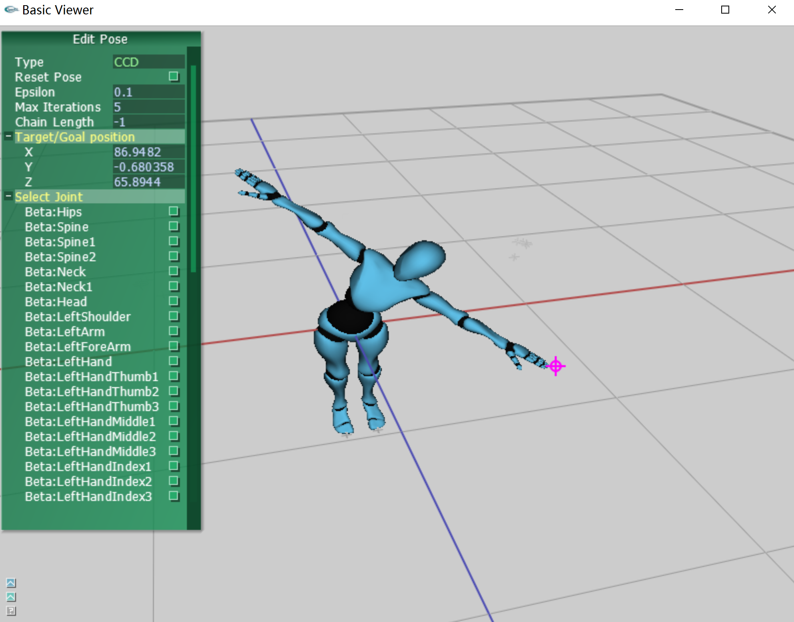

* **Particle Systems**
  * Fireworks Simulation:
  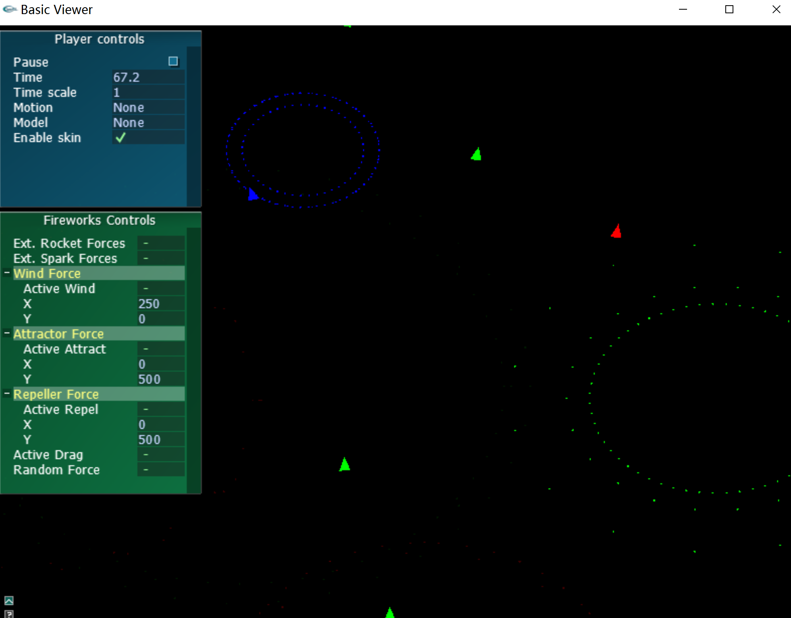

* **Behavioral Animation**
  [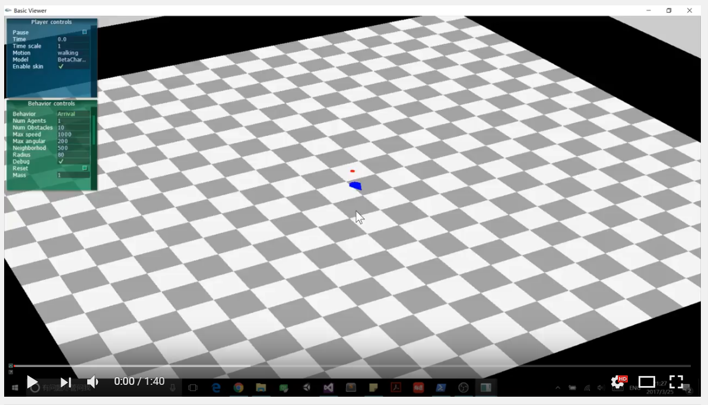](https://youtu.be/c14euppFaDA)
  

    
